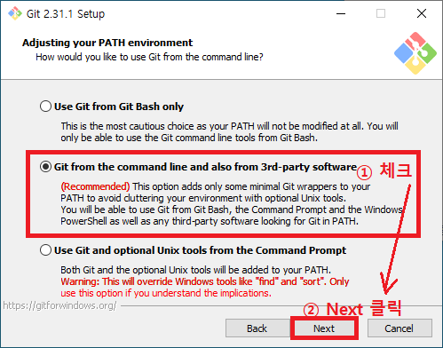

# Git 설치(windows)

| **[1] Git 설치 파일 다운로드** |
| ------------------------------ |

> https://git-scm.com/ 에 접속합니다.

.png)

- 접속 후, 빨간색 네모가 그려져 있는 부분의 `Download for windows`를 클릭합니다.
- 자신의 윈도우 사양(32비트, 64비트)에 맞게 설치 파일을 선택합니다.
- 다운로드 창이 나타나면 설치 파일을 다운로드 받습니다.
- `Git-2.xx.x-64-bit.exe`와 같은 설치 파일을 더블클릭하여 실행합니다.

| [2]Git 설치 |
| ----------- |

​						 <u>절대로 Git 설치 경로를 변경하지 않습니다!!</u>

.png)

| [3] Git 설치 확인 |
| ----------------- |

> Git이 제대로 설치되었는지 확인하는 작업입니다.

1.시작을 엽니다.(윈도우키)

2.git bash를 검색하고 클릭하여 엽니다.

.png)

3. 터미널 창에서 `git --version`을 입력하고 설치된 git 버전 정보가 잘 나오는지 확입합니다.

.png)

​			    사진과 똑같이 나오면 성공입니다.(버전은 조금 다를 수 있습니다.)